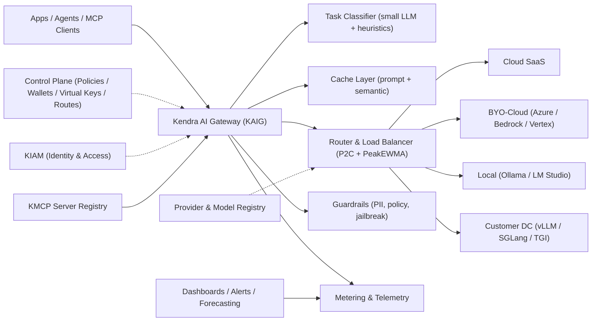
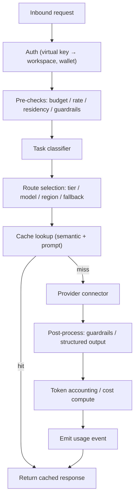

# 02 · Reference Architecture & Provider Connectors

**KAIG Definitive Documentation v1.2.0** · Last updated 2026-07-18 · Status: Active

All routing across Kendra Fabric flows through KAIG — a single OpenAI-compatible control surface for every model call, whether the target lives in a SaaS provider, a customer cloud, a developer laptop, or a customer data centre.

## 1. High-level shape

## 2. Layers and responsibilities

| Layer | Responsibility | Key components |
| --- | --- | --- |
| KAIG data plane | Handle every inference call — the hot path | API ingress, auth, classifier, router, cache, guardrails, connectors |
| Provider & Model Registry | Authoritative catalog of providers, models, price cards, params, health | Provider Console (doc 08) |
| Control plane | Configure the data plane | Policies, wallets, virtual keys, routes, residency rules |
| Identity | Authn/authz for humans and agents | KIAM (SSO, RBAC, ReBAC via OpenFGA, OPA/Rego) |
| Metering | Capture, store, expose usage events | Hot/warm/cold stores, OTel pipeline, FOCUS exporter |
| Observability | Dashboards, alerting, anomaly | BI, alerting, forecasting, replay |
| MCP fabric | Tool catalog and execution | KMCP server registry, RBAC on tools, schema validation |

### 2.1 Cross-cutting non-functional requirements

| Requirement | Target | Notes |
| --- | --- | --- |
| Gateway latency overhead (P99) | ≤ 25 ms edge · ≤ 50 ms enterprise | Excludes upstream provider time; covers classifier, cache lookup, route resolution. Stretch 3–5 ms hot path. |
| Response time | P95 ≤ 100 ms · P99 ≤ 200 ms | Gateway-attributable time only |
| Throughput | ≥ 350 req/s per vCPU | Linear horizontal scale on Kubernetes (EKS / GKE / AKS / OpenShift) |
| Concurrency | ≥ 1,000 concurrent connections per node | Async proxy with upstream connection pooling |
| Availability | 99.99% uptime SLA | Multi-provider failover + circuit breakers |
| Cache hit rate | 30–50% on RAG / repeat workloads | Combined prompt + semantic cache |
| Config propagation | Sub-second | Tier 1 + Tier 2 synthesized into Redis; zero-downtime hot reload |

## 3. Data-plane request lifecycle

## 4. Provider connectors (the four families)

| Connector | Transport | Notes |
| --- | --- | --- |
| Cloud SaaS | HTTPS over public internet, vault-stored keys | OpenAI, Anthropic, Google AI Studio, DeepSeek, Mistral, xAI |
| BYO-Cloud | Private link / VPC peering inside customer cloud | Azure OpenAI (incl. PTU), Bedrock (Provisioned Throughput), Vertex, Databricks Mosaic |
| Local / Edge | Localhost or LAN, OpenAI-compatible | Ollama, LM Studio, llama.cpp, single-node vLLM, MLX; Ollama flagged `concurrency=1` |
| Customer DC / On-prem | mTLS over private link / VPN to a KAIG edge runner inside the perimeter | vLLM, SGLang, TGI, NVIDIA NIM, Triton, GKE Inference Gateway; per-tenant residency zones |

### 4.1 Common connector requirements

- **Normalization** — translate the OpenAI-compatible request/response contract to and from each upstream dialect (chat, completions, embeddings, vision, audio, tool/function calling, streaming).
- **Reliability primitives** — retries with backoff, timeouts, fallback chains, load balancing (P2C + PeakEWMA), and a circuit breaker per `(provider, model, region)` tuple with auto-recovery probing.
- **Credential handling** — provider keys stay in the vault; callers use virtual keys only; raw keys never reach client code. JIT rotation without redeploy.
- **Health & telemetry** — real-time health probes detect latency spikes, HTTP 429 thresholds, and 5xx errors; every hop emits a trace linked by request ID.
- **Concurrency cap & residency pin** — enforced from the registry connection profile; violations fail closed.

### 4.2 Per-family requirements

- **Cloud SaaS** — vault-stored keys, per-provider rate-limit awareness (TPM / RPM), canary routing for new model versions, cost tracking against published price cards. Breadth via LiteLLM (1,600+ models across 100+ providers).
- **BYO-Cloud** — private link / VPC peering; honor provisioned-throughput commitments (Azure PTU, Bedrock Provisioned Throughput); region pinning to the customer's cloud region; usage billed to the customer account.
- **Local / Edge** — OpenAI-compatible localhost / LAN endpoints (Ollama `:11434`, LM Studio `:1234`); GPU profile, quantization, measured throughput recorded per endpoint; Ollama pinned `concurrency=1`; shareable over Tailscale / ZeroTier / LAN.
- **Customer DC / On-prem** — mTLS over private link / VPN to a KAIG edge runner inside the perimeter; per-tenant residency zones; the runner pulls signed route policies and pushes back usage events; never silent cross-region.

## 5. Control plane & three-tier config

Everything is GitOps. Control-plane state lives in Git, is applied via CI to a config service, and the data plane hot-reloads through a Redis cache (sub-second propagation).

- **Tier 1 — Static defaults** in Git: provider definitions, base price cards, route templates, fallback chains, baseline cache thresholds.
- **Tier 2 — Dynamic overrides** in the Provider Console: status flips, JIT secret rotation, parameter tuning, price-card publishing. Persisted in PostgreSQL, audited.
- **Tier 3 — Runtime cache** in Redis: a high-concurrency FastAPI proxy synthesizes Tier 1 + Tier 2 for sub-millisecond route resolution with zero downtime.

Requirements:

- **Auditability** — every Tier 2 mutation attributed to an actor with before/after state in PostgreSQL.
- **Zero-downtime reload** — Tier 3 synthesis never blocks the hot path; stale-but-valid config beats unavailability.
- **Deterministic resolution** — model defaults → route overrides → call overrides, each validated against the model card's allowed parameter ranges before the call leaves the gateway.
- **Rollback** — any published config reverts to the last-known-good Git commit; CI applies on merge.

## 6. Default storage stack

| Purpose | Store |
| --- | --- |
| Config / control plane | Postgres + Git (source of truth) |
| Hot reservations & rate limits | Redis (cluster, idempotency-key based) |
| Registry hot cache | Redis (per-request provider/model/price reads) |
| Usage events (warm) | Delta / BigQuery / Snowflake |
| Cold archive | Object store (Parquet) |
| Semantic cache | Vector DB (Pinecone / pgvector / Milvus) |
| Trace + logs | OTel collector → log warehouse |

## 7. Deployment topologies

- **Edge mode** — low-latency, OpenAI-compatible, close to apps; routes Cloud SaaS + BYO-Cloud. *Requirements:* ≤ 25 ms P99 overhead, stateless autoscaling nodes, no persistent PII at rest.
- **Enterprise mode** — full guardrails + DLP + audit, inside customer VPC; adds private-link, Customer DC, Local. *Requirements:* mandatory PII redaction + DLP, immutable audit log, KIAM SSO/RBAC, ≤ 50 ms P99 overhead.
- **Hybrid mode** — edge handles non-sensitive hot path; an enterprise edge runner in the customer VPC/DC handles sovereign traffic; shared control plane and registry. *Requirements:* residency-aware routing fails closed; policy bundles signed and pulled by the edge runner.
- **Air-gapped mode** — enterprise mode with SaaS connectors disabled; only Customer DC and Local providers activatable. *Requirements:* no outbound public egress, offline price cards, locally hosted registry + vault, deterministic operation on last-known-good config.

## 8. Integration with Kendra Fabric

- **KIAM** — authn/authz; supplies actor_id, workspace mapping, ReBAC decisions.
- **KCG (Context Graph)** — retrieval context, lineage, governance metadata.
- **KDP (Data Plane)** — emits/consumes the usage-event stream as a first-class data product.
- **KACP (Agentic Control Plane)** — orchestrates agents; every model invocation transits KAIG.
- **KMCP Gateway** — MCP-tool fabric; registered tools addressable by any route.
- **KORCH (Kendra Orchestrator)** — orchestration engine executing agent swarms.

## 9. Failure semantics

- **Provider failure** → circuit breaker trips on latency spikes, HTTP 429, or 5xx; traffic fails over along the fallback chain; if exhausted, return a structured soft-fail error (never a raw upstream error). Auto-recovery probing re-admits the provider.
- **Residency-pinned route failure** → fail closed, then peer-DC failover or a pre-approved in-region BYO-Cloud fallback. Never silent cross-region; a residency breach is a hard error.
- **Cache failure** → degrade to a direct provider call and alert SRE; correctness is never sacrificed for a cache hit.
- **Metering failure** → reservations continue from a local counter; usage events queued and replayed once the pipeline recovers (no lost billing).
- **Control-plane failure** → the data plane runs on last-known-good config from Redis; no hot-path dependency on Git or Postgres.
- **Budget exhaustion** → 429 with `retry-after` + escalation URL; optional auto-downshift to an efficiency-tier model before hard stop; never silent dropping.

## 10. Build / buy bias

Build the differentiating core (router, classifier, provider registry & console, Customer DC edge runner, FOCUS export); leverage LiteLLM for fast SaaS coverage and integrate Presidio / NeMo Guardrails / Langfuse / Helicone patterns where they accelerate time to value.

## 11. Deep seam — self-hosted serving (KME)

The **Customer DC** and **Local / Edge** connector families are specified in depth by Kendra Model Engine (KME), which owns everything below the model endpoint. KAIG registers each KME endpoint into the registry (doc 08) with the deployment block routing and FinOps depend on.

- **Model→stack tiering (T0–T4):** SLM/edge (≤3B) → small (7–9B) → mid (13–34B) → large (70B) → MoE/XL (up to 405B / DeepSeek-V3). Tier sets the minimum viable stack; decode is memory-bandwidth bound (rule: 1.2–1.5× FP16 weight in VRAM + KV headroom).
- **Engine selection:** vLLM (default high-concurrency), SGLang (MoE / heavy prefix reuse via RadixAttention), TensorRT-LLM (latency-critical NVIDIA), NIM/Triton (vendor-supported), Ollama/llama.cpp/MLX (edge, `concurrency=1`).
- **Reference stack layers L0–L5** and three deployment targets (enterprise cloud / co-location / in-house air-gapped) travel with the endpoint; only L0–L1 change on promotion. KAIG consumes measured throughput + GPU profile to compute the amortised $/MTok routing anchor.

## 12. Deep seam — usage-event data product (KDP)

KAIG's metering stream is not a private log: usage events are published as a governed **Agentic Data Product** on the KDP stream-first metadata bus (MCE / MAE), entity-aspect modelled, lineage-traced, and FinOps-attributed, so metering is queryable, governed, and rebuildable from the event log (detail in doc 07).

## 13. Deep seam — tool fabric (KMCP) & runtime (KOrchestrator)

KAIG and KMCP are complementary gateways: KMCP is the **tool-calling PEP** in front of the KACP PDP; KAIG is the **inference PEP**. Both share KIAM identity, Token Vault, and per-agent FinOps attribution. In KOrchestrator, the single `SuperstepActivity` calls models through KAIG and tools through KMCP; the in-run **LLM Router v2.1** resolves against KAIG registry ModelCards rather than opening direct provider connections (doc 03 §10).

## 14. Reference deployment patterns (industry alignment)

- **Managed gateway** — hosted control plane (Portkey-style) fronting SaaS providers; fastest to stand up, accepted vendor dependency. Maps to KAIG **Edge mode**.
- **Self-hosted proxy** — an OpenAI-compatible proxy the platform team owns (LiteLLM-style), backed by Postgres (keys and spend) and Redis (routing state), with a logging/OTel backend. Maps to KAIG **Enterprise mode** inside the customer VPC.
- **Enterprise platform** — self-hosted, horizontally-scaled gateway with IdP-imported groups and RBAC, in-path guardrails, full observability, evolving toward agent- and MCP-gateway duties. Maps to KAIG **Hybrid / Enterprise mode**.

## 15. Timeout-budget allocation & anti-patterns

**Timeout budgeting.** The user-facing latency budget is allocated top-down across the call path so retries and fallbacks still fit inside it: the caller's deadline minus gateway overhead (§2.1) bounds the primary attempt, and each fallback hop must fit within the remaining budget. A primary timeout set too high leaves no room for a fallback to complete — the timeout is derived from the budget, not chosen independently.

**Anti-patterns KAIG designs against:**

- **Double-proxying** — chaining two gateways compounds latency, doubles the failure surface, fragments telemetry. One control point per hop.
- **Unbounded fallback chains** — chains are length-bounded and eval-checked so a fallback cannot change response shape undetected.
- **Fallback to an incompatible response contract** — a fallback model that alters tool-calling or output schema trades a loud outage for a quiet parse failure; fallbacks are validated for contract compatibility.
- **Gateway as identity system** — groups and RBAC are imported from the IdP, never re-invented inside the gateway.
- **Shared raw provider keys** — callers present virtual keys only (doc 04).
