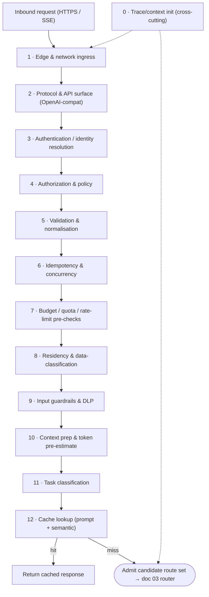

# 02A · Ingress & Pre-Routing Pipeline

**KAIG Definitive Documentation v1.1.0** · Last updated 2026-07-10 · Status: Active

The **pre-routing pipeline** is everything KAIG does between the inbound request and the moment a model is chosen — identity, policy, budget, residency, guardrails, normalisation and classification — that makes every call safe, governed, attributed and cache-ready **before** route selection begins. A managed engine such as Portkey (or LiteLLM) implements parts of the back half; KAIG owns this front half end to end so the gateway is complete regardless of which routing engine sits behind it.

## 1. Scope & position in the request lifecycle

This document specifies the ordered stages that run **before** the router selects a tier/model/region (doc 03 §1). It expands the compressed lifecycle in doc 02 §3 into a complete, testable contract.

**Why this matters — "beyond Portkey."** A managed gateway product or an open-source proxy primarily solves the *back half*: provider normalisation, routing, fallback, retries. If KAIG delegated everything to that layer, it would inherit whatever identity, budget, residency and guardrail behaviour the vendor happens to offer. KAIG instead owns the pre-routing pipeline as first-class infrastructure, so those controls are enforced **once, at the boundary**, and the routing engine behind it becomes a replaceable component.

**Boundary rule.** The pipeline ends the instant a candidate route set is admitted to the router. Route/model selection, load balancing, fallback and dispatch belong to doc 03. Cache *lookup* is the final pre-dispatch step here (§13) because a hit must short-circuit the provider call; cache *policy* is owned by the route (doc 03 §7, doc 05).

## 2. Pipeline overview

## 3. Stage contract (at a glance)

| # | Stage | Responsibility | Default failure mode | Source-of-truth plane |
| --- | --- | --- | --- | --- |
| 0 | Trace/context init | Assign trace id, actor id, workspace id, wallet id; open OTel span | Fail open (log-and-continue) | Doc 07 · Observability |
| 1 | Edge & network ingress | TLS/mTLS termination, WAF/DDoS, PoP selection, connection pooling | Fail closed | KAIG data plane |
| 2 | Protocol & API surface | OpenAI-compatible parse, endpoint + size limits, streaming negotiation | Fail closed (400) | KAIG data plane |
| 3 | Authentication | Virtual key / JWT / mTLS → resolve actor, workspace, wallet | Fail closed (401) | KIAM (doc 04) |
| 4 | Authorization & policy | RBAC/ReBAC, model allowlist, risk-tier gate, policy-as-code | Fail closed (403) | KIAM (doc 04) / KAGP |
| 5 | Validation & normalisation | Schema + parameter validation, dialect + multimodal normalisation | Fail closed (422) | KAIG data plane |
| 6 | Idempotency & concurrency | Idempotency-key dedup, concurrency cap admission | Fail closed (409/429) | KAIG data plane |
| 7 | Budget / quota / rate | Wallet balance, budget reservation, TPM/RPM, token pre-estimate | Fail soft (429 + downshift) | FinOps (doc 05) |
| 8 | Residency & classification | Residency zone resolution, data-class tagging, sovereignty eligibility | Fail closed (503) | Regula / doc 06 |
| 9 | Input guardrails & DLP | PII redaction, prompt-injection/jailbreak, moderation, secret scan | Fail closed (policy-set) | Security (doc 06) |
| 10 | Context prep | Prompt assembly, compression, cache-key computation, token estimate | Fail soft (degrade) | KAIG / FinOps (doc 05) |
| 11 | Task classification | Task type, complexity, sensitivity, expected output size | Fail soft (default class) | KAIG (doc 03 §2) |
| 12 | Cache lookup | Prompt-exact + semantic lookup; hit short-circuits provider | Fail soft (treat as miss) | KAIG / FinOps (doc 05) |

## 4. Stage 1 — Edge & network ingress

- **Transport termination** — TLS 1.3 for public callers; mTLS for Customer-DC edge runners and service-to-service calls. HTTP/2 + keep-alive with upstream connection pooling to hold ≥ 1,000 concurrent connections per node.
- **Perimeter protection** — WAF, L3/L4 + L7 DDoS mitigation, IP allow/deny lists, per-tenant connection quotas, applied before any application logic runs.
- **PoP / mode selection** — the caller is bound to an edge, enterprise or hybrid node per doc 02 §7; sovereign traffic is pinned to an in-perimeter runner before parsing.
- **Back-pressure** — overload sheds load with 503 + `retry-after` rather than queueing unboundedly; the hot path never blocks on a slow dependency.

**Requirements:** TLS 1.3 mandatory at the controller, no plaintext internal hops; ingress adds no synchronous external dependency (telemetry is async off the hot path); direct-to-provider egress blocked — all traffic transits the governed edge.

## 5. Stage 2 — Protocol & API surface

- **OpenAI-compatible contract** — one surface for `chat.completions`, `responses`, `completions`, `embeddings`, vision, audio, and tool/function calling; streaming (SSE) negotiated here and preserved end to end.
- **Structural validation** — reject malformed envelopes with a structured 400; enforce max request body size, max messages, max declared `max_tokens` before deeper processing.
- **Version & deprecation handling** — map dated API shapes to the internal canonical contract; surface deprecation headers without breaking callers.
- **Never leak upstream shapes** — callers see the KAIG contract only; provider dialects are hidden until the connector layer (doc 02 §4).

**Requirements:** SSE passthrough with backpressure, no buffering that breaks TTFT; a uniform request/response envelope established pre-routing.

## 6. Stage 3 — Authentication (identity resolution)

Every request is resolved to a concrete identity **before** any spend or model exposure. KAIG consumes KIAM primitives (doc 04); it does not re-specify them.

- **Credential types** — gateway-issued **virtual keys** (default), KIAM SSO/OIDC **JWTs** for human callers, **mTLS client certificates** for services and edge runners, and **On-Behalf-Of** delegation tokens for agent calls (shared with KMCP).
- **Resolution output** — each accepted credential yields `actor_id`, `workspace_id`, `wallet_id`, and the virtual key's scope/permission set, all attached to the trace context.
- **Credential hygiene** — raw provider keys never reach client code; virtual keys proxy Token-Vault credentials and support JIT rotation without redeploy.
- **Failure** — unresolved or expired credentials fail closed with 401; no classification, cache, or routing work is performed for an unauthenticated request.

**Requirements:** reject unverifiable/expired tokens (deny-by-default); delegated tokens must attenuate, never escalate, scope at each hop; support human SSO/OIDC, workload identity (SPIFFE/SPIRE X.509), OAuth 2.1 client-credentials, and OIDC-A recursive delegation with RFC 8693 token exchange.

## 7. Stage 4 — Authorization & policy

- **RBAC / ReBAC** — role and relationship checks via OpenFGA; e.g. "agent X may call model tier ≤ T2 in workspace Y."
- **Model allowlists & risk-tier gate** — the target model class is checked against the workspace allowlist and the KAGP risk tier; disallowed tiers fail closed before spend.
- **Policy-as-code** — OPA/Rego policies evaluate actor, workspace, route and data-class attributes; declarative GitOps config, hot-reloaded via the three-tier model (doc 02 §5).
- **Scope enforcement** — call-level parameter overrides permitted only within the virtual key's granted scope (doc 03 §9).

**Requirements:** deny-by-default with explicit allow per route/scope; separate identity (Keycloak), relationships (OpenFGA) and policy logic (OPA/Rego), with the gateway as PEP calling a PDP; prefer ABAC / context-aware decisions (time, geo, trust score).

## 8. Stage 5 — Validation & normalisation

- **Schema validation** — validated against the canonical contract; unknown or malformed fields yield a structured 422.
- **Parameter validation** — `temperature`, `top_p/top_k`, `max_tokens`, stop sequences and penalties checked against the model card's allowed ranges (doc 08).
- **Multimodal handling** — image/audio/file parts validated for type, size and count; oversized payloads rejected or offloaded per policy.
- **Normalisation** — inbound content normalised to the canonical internal representation so guardrails, classifier and cache-key operate on one shape.

## 9. Stage 6 — Idempotency & concurrency control

- **Idempotency keys** — Redis-backed store dedupes retried writes so a client retry never double-charges a wallet or double-dispatches a call.
- **Concurrency admission** — per-tenant and per-key concurrency caps from the registry connection profile; violations fail closed with 429 before reservation.
- **Replay safety** — the idempotency record captures the eventual response reference so identical keys return the same outcome within the TTL window.

## 10. Stage 7 — Budget, quota & rate-limit pre-checks

These checks make spend a **pre-condition**, not an after-the-fact reconciliation. Depth in doc 05.

- **Token pre-estimate** — input tokens counted and output tokens estimated from the request + task class, producing a projected cost against the model's price card.
- **Wallet & budget reservation** — projected cost reserved against the `wallet_id`; insufficient budget triggers the fail-soft path: 429 with `retry-after` + escalation URL, or optional auto-downshift to an efficiency-tier model before a hard stop.
- **Rate limiting** — TPM/RPM ceilings per key/workspace/provider; on breach the request is shaped or shifted rather than silently dropped (doc 03 §5a).
- **Metering continuity** — if metering is degraded, reservations continue from a local counter and events are queued for replay (doc 02 §9).

**Implementation notes:** resolve `wallet_id` from the JWT and check hierarchical wallets (Org → Workspace → Project) before admission; enforce TPM/RPM with a token-bucket (Redis Lua) at the edge; soft alerts at 75/80% utilisation; hard cap blocks with 429 + remediation; global kill switch honoured.

## 11. Stage 8 — Residency & data-classification pre-checks

- **Data classification** — content and metadata tagged with a data class (public, internal, PII, regulated-FS) that drives residency and guardrail policy.
- **Residency resolution** — routes declaring `residency: customer` resolve only to models tagged with the matching `residency_zone`; the eligible provider set is filtered **before** routing (doc 03 §6).
- **Sovereignty & fail-closed** — a residency breach is a hard error: fail closed (503), then peer-DC or pre-approved in-region BYO-Cloud fallback. Cross-region is never silent.
- **FS overlays** — Regula policy bundles attach residency + control requirements per route (SR 11-7, DORA, BCBS 239, MAS FEAT, FCA). Rego bundle examples: `regula.uk.fca.prin`, `regula.eu.dora`, `regula.us.sr-11-7`, `regula.apac.mas-feat`.

**Requirements:** residency evaluated pre-routing; non-compliant targets excluded from the candidate set; residency overrides cost/latency preferences.

## 12. Stage 9 — Input guardrails & DLP

Guardrail orchestration is owned by KAIG; detector depth lives in doc 06. KAIG runs input guardrails **inline** on the pre-routing path.

- **PII detection & redaction** — Presidio-style detectors redact or tokenise PII before the prompt reaches any provider; enterprise mode makes redaction mandatory.
- **Prompt-injection & jailbreak defense** — heuristic + model-based detectors screen for injection, exfiltration and jailbreak patterns; policy decides block vs. sanitise vs. flag.
- **Content moderation & secret scanning** — disallowed-content and secret/credential scanners run before dispatch; hits fail closed per the policy set for the data class.
- **Latency discipline** — guardrails are the largest pre-routing latency contributor; they run within the enterprise ≤ 50 ms P99 budget and are selectively skippable for low-risk classes to preserve the ≤ 25 ms edge budget.

**Targets:** 20+ PII types detected via Presidio + RegEx with a tokenise-then-rehydrate flow (>99% detection at <0.5% FP); masking modes (full/partial/hash) configurable per data class.

## 13. Stages 10–12 — Context prep, classification & cache lookup (handoff)

- **Context preparation (10)** — prompt/prefix assembly, context compression and top-k discipline, plus computation of the **cache key** and KV/prefix-cache hints consumed later by doc 03 §11.
- **Task classification (11)** — a small LLM + heuristics label task type, complexity, sensitivity and expected output size (doc 03 §2). Classifier latency ≤ 100 ms; a distilled transformer (~65M params, 20–100 ms) is the reference. Its output is a routing *input*, not a routing *decision*.
- **Cache lookup (12)** — prompt-exact + semantic lookup runs before any provider call; a semantic hit above the cosine threshold (typically 0.85–0.95, Redis vector index `DIM 1536`, `COSINE`) returns instantly and short-circuits routing. A cache failure degrades to a miss, never an error. A hit still records FinOps/telemetry.
- **Handoff** — on a miss, KAIG admits the filtered, budget-reserved, residency-eligible candidate set to the router (doc 03).

## 14. Latency budget allocation

Indicative allocation of the enterprise budget (≤ 50 ms P99; edge ≤ 25 ms):

| Stage group | Indicative P99 budget | Notes |
| --- | --- | --- |
| Ingress + protocol (1–2) | ≤ 3 ms | TLS reuse + async parse; amortised by connection pooling |
| Authn + authz (3–4) | ≤ 5 ms | Cached KIAM decisions; OpenFGA/OPA reads from Redis |
| Validation + idempotency + FinOps (5–7) | ≤ 7 ms | Redis reservations; token pre-estimate is the main cost |
| Residency + guardrails (8–9) | ≤ 25 ms | Guardrails dominate; skippable for low-risk classes at edge |
| Context + classify + cache (10–12) | ≤ 10 ms | Classifier + embedding lookup; offset by cache short-circuit |

Edge mode achieves ≤ 25 ms by skipping mandatory DLP and selecting lightweight guardrail profiles for low-risk data classes; enterprise mode accepts the larger budget in exchange for full inline controls.

## 15. Fail-open vs. fail-closed matrix

| Concern | Posture | Behaviour on failure |
| --- | --- | --- |
| Trace/telemetry init | Fail open | Log-and-continue; never block the hot path on observability |
| Authentication / authorization | Fail closed | 401/403; no downstream work performed |
| Residency / data sovereignty | Fail closed | 503 then in-region failover; never silent cross-region |
| Guardrails / DLP | Fail closed (policy-set) | Block or sanitise per data-class policy; enterprise redaction mandatory |
| Budget / rate limit | Fail soft | 429 + escalation, or auto-downshift; hard caps beat silent retries |
| Cache lookup | Fail soft | Treat as miss; correctness never sacrificed for a hit |
| Control-plane config | Fail soft | Run on last-known-good config from Redis (doc 02 §9) |

## 16. Requirements checklist

- [ ] Every request resolves to `actor_id`, `workspace_id`, `wallet_id`, and a trace id before any spend or model exposure.
- [ ] Identity, authorization and residency fail closed; budget fails soft; telemetry fails open.
- [ ] Provider keys never leave the vault; callers use virtual keys only.
- [ ] Input guardrails run inline before dispatch; enterprise mode enforces mandatory PII redaction + DLP.
- [ ] Budget is reserved pre-flight from a token estimate; no call escapes attribution even under metering degradation.
- [ ] Residency-eligible provider set is filtered before the router runs; cross-region failover is never silent.
- [ ] Total pre-routing overhead stays within ≤ 25 ms P99 edge · ≤ 50 ms P99 enterprise, verified in CI load tests.
- [ ] The routing engine (Portkey / LiteLLM / native) is a replaceable component behind this pipeline, not the source of truth for identity, budget, residency or guardrails.
