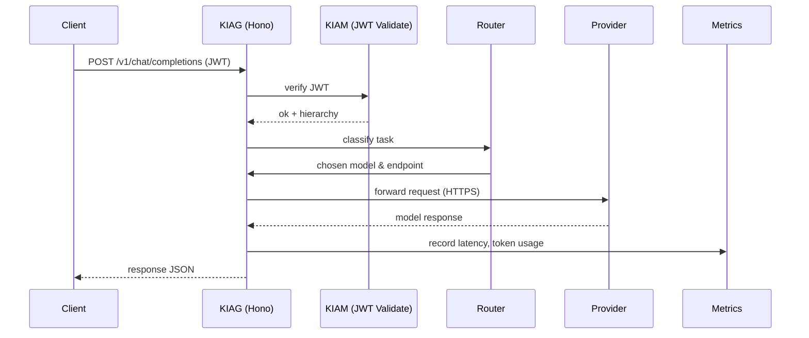
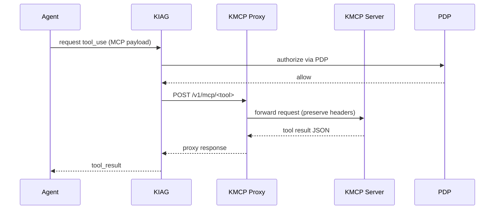

# AI Gateway (KIAG) & Kendra MCP (KMCP) – Detailed Requirements

---

## Table of Contents
1. [Epics Overview](#epics-overview)
2. [Stories & Tasks](#stories--tasks)
3. [Dependencies & Milestones](#dependencies--milestones)
4. [Architecture](#architecture)
   - [High‑Level System Diagram](#high‑level-system-diagram)
   - [Component Interactions (Sequence Diagrams)](#component-interactions-sequence-diagrams)
5. [UX / UI Design](#ux--ui-design)
   - [Storybook Component Library](#storybook-component-library)
   - [Design Tokens & Theme](#design-tokens--theme)
6. [User Journeys](#user-journeys)
7. [Appendix – Reference Links](#appendix–reference-links)

---

## Epics Overview
| Epic ID | Title | Goal | High‑Level Acceptance Criteria |
|---------|-------|------|--------------------------------|
| **E1** | **AI Gateway Core Platform** | Deliver a production‑grade, OpenAI‑compatible gateway that routes inference requests, applies guardrails, meters usage and integrates KMCP tool calls. | • All OpenAI‑compatible endpoints (`/v1/chat/completions`, `/v1/completions`, etc.) functional. <br>• Latency ≤ 25 ms P99 on edge, ≤ 50 ms P99 in enterprise mode (excluding upstream provider time). <br>• Prometheus metrics exposed and accurate. |
| **E2** | **Security & Guardrails** | Enforce identity, access, PII redaction, injection‑jailbreak protection, and output filtering per spec. | • JWT validation against KIAM JWKS with 60 s hierarchy cache. <br>• PII detection & redaction (Presidio style) with optional re‑hydration. <br>• Injection/jailbreak block with audit log entry. |
| **E3** | **MCP Front‑End (Admin Dashboard & Playground)** | Provide a React + Vite UI for operators to manage MCP servers, policies, virtual keys and to test end‑to‑end flows. | • UI consumes the design system defined in the local **Storybook** (`kendrastorybook`). <br>• Auth via OIDC against KIAM; role‑based component rendering. <br>• Playground shows raw request, guarded request, KMCP call trace, and final response. |
| **E4** | **Backend Admin APIs** | Expose CRUD APIs for MCP server configuration, virtual‑key lifecycle, and policy‑bundle management. | • OpenAPI spec generated and validated. <br>• Authorization via PDP for each operation. |
| **E5** | **Observability & FinOps** | Implement full telemetry, metering, budgeting and cost attribution pipeline. | • Prometheus, OpenTelemetry traces, and Grafana dashboards. <br>• Token‑based usage events stored in BigQuery (KDP). |

---

## Stories & Tasks
Below each story is broken into atomic tasks that can be mapped to Jira *User Story* issues.  The tasks are ordered to respect the dependencies column.

### Epic **E1 – AI Gateway Core Platform**
| Story ID | Description | Tasks | Dependencies |
|----------|-------------|-------|--------------|
| **S1.1** | **Server bootstrap & API** – Initialise the Hono server, health‑check, graceful shutdown. | 1. Create `src/start-server.ts` that loads `conf.json` and starts Hono. <br>2. Add `/healthz` and `/readyz` routes. <br>3. Wire graceful shutdown on SIGTERM. | – |
| **S1.2** | **MCP request handling** – Implement `/v1/mcp/*` proxy (already added) and integrate with cache. | 1. Refactor `mcpHandler` to use `src/providers/mcp/client.ts`. <br>2. Add request‑ID propagation. <br>3. Add Prometheus metrics (`kmcp_proxy_duration_seconds`). | S1.1 |
| **S1.3** | **Cache & credential management** – Load `mcp‑servers‑auth.json` into an in‑memory cache, watch for changes. | 1. Create `src/providers/mcp/cache.ts`. <br>2. Expose `getKMCPBase(serverId)` helper. <br>3. Add unit tests for cache refresh. | S1.1 |
| **S1.4** | **Observability & metrics** – Integrate `prom-client`, expose `/metrics`, add request‑ID middleware. | 1. Install `prom-client`. <br>2. Record latency per endpoint (including MCP proxy). <br>3. Add request‑ID header generation middleware. | S1.1 |
| **S1.5** | **Routing & reliability** – Implement Power‑of‑Two‑Choices + PeakEWMA load‑balancer for provider selection. | 1. Create `src/router/loadBalancer.ts`. <br>2. Add fallback chain configuration. <br>3. Write integration tests simulating latency spikes. | S1.1, S1.4 |

### Epic **E2 – Security & Guardrails**
| Story ID | Description | Tasks | Dependencies |
|----------|-------------|-------|--------------|
| **S2.1** | **Token validation & hierarchy cache** – Verify JWTs, cache KIAM hierarchy. | 1. Implement JWKS fetch (`src/security/jwks.ts`). <br>2. Cache hierarchy (60 s TTL) in Redis (or in‑memory for prototype). <br>3. Fail closed on verification errors. | – |
| **S2.2** | **Policy Decision Point (PDP) integration** – Call KACP PDP for allow/deny decisions. | 1. Create `src/security/pdpClient.ts`. <br>2. Map PDP response to internal `Decision` enum. <br>3. Add timeout handling (< 50 ms). | S2.1 |
| **S2.3** | **PII detection & redaction** – Integrate Presidio‑style classifier. | 1. Add middleware `src/middlewares/piiMasking.ts`. <br>2. Store redaction map per request for optional rehydration. | S2.2 |
| **S2.4** | **Prompt‑injection & jailbreak defense** – Run rule engine before dispatch. | 1. Add rule engine (`src/security/injectionEngine.ts`). <br>2. Block or sanitize malicious content, emit audit log. | S2.2 |
| **S2.5** | **Output filtering & rehydration** – Apply NeMo Guardrails, toxicity check, and optional PII re‑insertion. | 1. Middleware `src/middlewares/outputGuard.ts`. <br>2. Integrate NeMo Guardrails SDK. | S2.3, S2.4 |
| **S2.6** | **Audit‑Vault emission** – Emit bitemporal decision‑trace nodes to Kendra Context Graph. | 1. Define PROV‑O schema (JSON‑LD). <br>2. Async queue (Pub/Sub) to push nodes. | S2.5 |

### Epic **E3 – MCP Front‑End (Admin Dashboard & Playground)**
| Story ID | Description | Tasks | Dependencies |
|----------|-------------|-------|--------------|
| **S3.1** | **Project scaffolding** – Initialise Vite + React + TS, CI integration. | 1. `npx -y create-vite@latest ./frontend --template react-ts`. <br>2. Add ESLint, Prettier, Jest config. <br>3. CI step to run `npm ci && npm test && npm run build`. | – |
| **S3.2** | **Authentication flow** – OIDC login against KIAM, token storage, role‑based UI. | 1. Implement `AuthProvider` using `openid-client`. <br>2. Store JWT in HttpOnly cookie. <br>3. Guard routes with `<RequireAuth roles={[...]}>`. | S3.1 |
| **S3.3** | **MCP Server Management UI** – List, create, edit, revoke virtual keys. | 1. Table component (Storybook `Table` component). <br>2. Modal dialogs for create/edit (Storybook `Modal`). <br>3. Wire to backend CRUD (`/api/v1/mcp/servers`). | S3.2, E4 (S4.1) |
| **S3.4** | **Policy Editor** – Visual OPA bundle explorer, toggles for guardrail enablement. | 1. Tree view component (Storybook `TreeView`). <br>2. Checkbox toggles that PATCH policy via `/api/v1/policy`. <br>3. Live preview of guardrail impact (request‑trace panel). | S3.2, S2.* |
| **S3.5** | **Playground** – End‑to‑end request builder, KMCP selector, trace view. | 1. Prompt textarea, model selector, dropdown for KMCP tool. <br>2. Show before/after redaction, injection block reason, final response. <br>3. Export trace JSON. | S3.2, S2.* |
| **S3.6** | **Observability dashboards** – Token‑validation latency, cache hit/miss, guard‑rail trigger counters. | 1. Chart components (Storybook `Chart`). <br>2. Pull metrics from `/metrics`. <br>3. CSV download button. | S3.1, S1.4 |

### Epic **E4 – Backend Admin APIs**
| Story ID | Description | Tasks | Dependencies |
|----------|-------------|-------|--------------|
| **S4.1** | **MCP server CRUD** – `GET/POST/PUT/DELETE /api/v1/mcp/servers`. | 1. Define OpenAPI schema (re‑use `MCPToolset`). <br>2. Implement handlers in `src/handlers/mcpAdminHandler.ts`. <br>3. Persist to `mcp‑servers‑auth.json` and refresh cache. | S2.1, S2.2 |
| **S4.2** | **Virtual‑key lifecycle** – Issue, list, revoke keys per workspace. | 1. JWT generation with scoped claims. <br>2. Store revocation list (Redis). <br>3. Endpoints `/api/v1/keys`. | S4.1 |
| **S4.3** | **Policy bundle upload** – Accept OPA bundle zip, store versioned config. | 1. Validate bundle signature. <br>2. Store in GCS bucket `policy-bundles/`. <br>3. Trigger cache invalidation for PDP. | S2.2 |

---

## Dependencies & Milestones
| Milestone | Target Date | Items Completed |
|-----------|-------------|-----------------|
| **M1 – Core Platform MVP** | 2026‑09‑01 | E1 (S1.1‑S1.5) + basic metrics |
| **M2 – Security Foundations** | 2026‑09‑15 | E2 (S2.1‑S2.3) |
| **M3 – Admin API Layer** | 2026‑09‑30 | E4 (S4.1‑S4.2) |
| **M4 – Front‑End Playground** | 2026‑10‑15 | E3 (S3.1‑S3.5) + storybook integration |
| **M5 – Full Guardrails & Auditing** | 2026‑10‑31 | E2 (S2.4‑S2.6) + observability dashboards |
| **M6 – Production Release** | 2026‑11‑15 | All epics, performance tests, documentation, CI/CD |

---

## Architecture
### High‑Level System Diagram
```mermaid
flowchart LR
    A[Client (Web / SDK)] -->|HTTPS| B[AI Gateway (KIAG)]
    B -->|MCP Proxy| C[KMCP Server Registry]
    B -->|Provider Connectors| D[Cloud SaaS / BYO‑Cloud / Edge / DC]
    B -->|PDP| E[KIAM Identity & Access]
    B -->|Metrics| F[Prometheus]
    B -->|Usage Events| G[BigQuery (KDP)]
    C -->|Tool Calls| H[Tool Services (DB, Search, etc.)]
    style B fill:#0f62fe,color:#fff,stroke:#1e90ff,stroke-width:2px
    style C fill:#ffb000,color:#000,stroke:#ffa500,stroke-width:2px
```

### Component Interaction Sequence Diagrams
#### 1️⃣ Inference Request (Chat Completion) – Edge Mode

#### 2️⃣ MCP Tool Call from Agent


---

## UX / UI Design
The UI must **reuse the design system already authored in the local Storybook** (`kendrastorybook`). All components (Buttons, Tables, Modals, Charts, TreeView, etc.) are defined there and are exported as a **design token** library.

### Storybook Component Library
| Component | Storybook Path | Intended Use |
|-----------|----------------|--------------|
| **Button** | `src/Buttons.stories.tsx` | Primary actions (Create, Save, Delete). |
| **Table** | `src/Table.stories.tsx` | List MCP servers, virtual keys, audit logs. |
| **Modal** | `src/Modal.stories.tsx` | Create / Edit dialogs. |
| **TreeView** | `src/TreeView.stories.tsx` | OPA policy visualiser. |
| **Chart** | `src/Chart.stories.tsx` (uses Recharts) | Metrics dashboards. |
| **Badge** | `src/Badge.stories.tsx` | Status indicators (active, error). |
| **Spinner** | `src/Spinner.stories.tsx` | Loading states. |

All components inherit the **global theme** (`src/foundations/tokens.tsx`) which defines:
- Dark & light palette with custom HSL values (e.g., `--color-primary = hsl(220, 90%, 55%)`).
- Typography from Google Font **Inter** (weights 400‑700).
- Micro‑animations via CSS `transition` (0.2 s) for hover/focus.

### Design Tokens & Theme Integration
```tsx
// src/foundations/tokens.tsx (excerpt)
export const tokens = {
  colors: {
    primary: "hsl(220, 90%, 55%)",
    secondary: "hsl(180, 70%, 45%)",
    background: "hsl(0, 0%, 12%)",
    surface: "hsl(0, 0%, 16%)",
    error: "hsl(0, 80%, 45%)",
  },
  radii: { sm: "4px", md: "8px", lg: "12px" },
  shadows: {
    low: "0 1px 3px rgba(0,0,0,0.12)",
    high: "0 4px 12px rgba(0,0,0,0.2)"
  },
  typography: {
    fontFamily: "'Inter', sans-serif",
    baseSize: "16px",
    weight: { regular: 400, medium: 500, bold: 700 }
  }
};
```
The React app imports these tokens and wraps the root with a **ThemeProvider** from `styled-components`.

### UI Pages (High‑Level Wireframes)
1. **Dashboard** – Overview cards (latency, request count, guardrail triggers). Uses `Chart` and `Badge` components.
2. **MCP Server List** – Table with columns *Name, Status, Auth Type, Actions*. Row actions open a `Modal` for edit.
3. **Policy Editor** – `TreeView` representing OPA rules; toggle switches (`Switch` component) enable/disable specific guardrails.
4. **Playground** – Split pane: left side request builder (textarea, dropdowns), right side response viewer with **diff view** (original vs. guarded). Utilises `CodeBlock` component from Storybook.
5. **Audit Log** – Paginated table with sortable columns, filter by date, severity.

All pages respect **dark‑mode** (auto‑detect via CSS `prefers-color-scheme`) and have subtle glass‑morphism cards (`backdrop-filter: blur(8px)`). Hover effects animate `transform: translateY(-2px)`.

---

## User Journeys
### Journey 1 – Operator adds a new KMCP server
1. Operator logs into the Dashboard via OIDC (handled by `AuthProvider`).
2. Navigates to **MCP → Servers**. Clicks **Add Server** button.
3. Modal opens (Storybook `Modal`). Operator fills *Server ID*, *Base URL*, and uploads a JSON credential file.
4. On **Save**, the UI calls `POST /api/v1/mcp/servers`. Backend validates schema, stores entry in `mcp‑servers‑auth.json`, refreshes cache, and returns 201.
5. UI updates table instantly (optimistic UI) and shows a **success** `Badge`.
6. Agentic workflows can now call tools hosted on the new server.

### Journey 2 – Developer tests a tool in the Playground
1. Developer authenticates, opens **Playground** page.
2. Selects **Tool** = `search_documents` from dropdown (populated from KMCP registry).
3. Enters prompt: `"Find the latest sales report for Q2"`.
4. Clicks **Run** – request passes through KIAG: JWT validation → PDP → guardrails (PII, injection) → MCP proxy.
5. The UI shows three panes:
   - **Raw Request** (original JSON). 
   - **Guarded Request** (redacted PII, injection blocked if any). 
   - **KMCP Response** (tool output). 
6. The user can export the trace as JSON for debugging.

### Journey 3 – Security analyst reviews a guard‑rail trigger
1. Analyst opens **Audit Log** page, filters by `event_type=guardrail_block`.
2. Clicks a row → modal displays **decision trace** (PROV‑O node view). Shows which policy (e.g., `pii_detection`) caused the block, the original content, and the redacted version.
3. Analyst can approve a false positive via **Approve** button, which calls `POST /api/v1/audit/override` and updates the audit node.

---

## Appendix – Reference Links
- **Storybook repo** – `kendrastorybook` (local). <br>  Path: `/Users/alpesh/Software/kendrastorybook` (already checked out). <br>  UI components can be imported via `npm link` or as a workspace package.
- **Spec files** – listed in `docs/specs/` (00‑overview.md … 09‑roadmap.md). <br>  These are the source of truth for architecture and non‑functional requirements.
- **MCP Registry API** – official endpoint: `GET https://registry.modelcontextprotocol.io/v0/servers` (see web‑search result).
- **KIAM JWKS URL** – `https://kiam.mycompany.com/.well-known/jwks.json` (configured in `conf.json`).
- **OpenTelemetry docs** – https://opentelemetry.io/docs/

---

*All epics, stories, tasks and diagrams are now stored in `docs/specs/requirements.md` and can be imported into Jira as user‑story issues (e.g., `AI‑GW‑E1‑S1.1`). The UI should be built against the existing Storybook component library to guarantee visual consistency and premium design aesthetics.*
